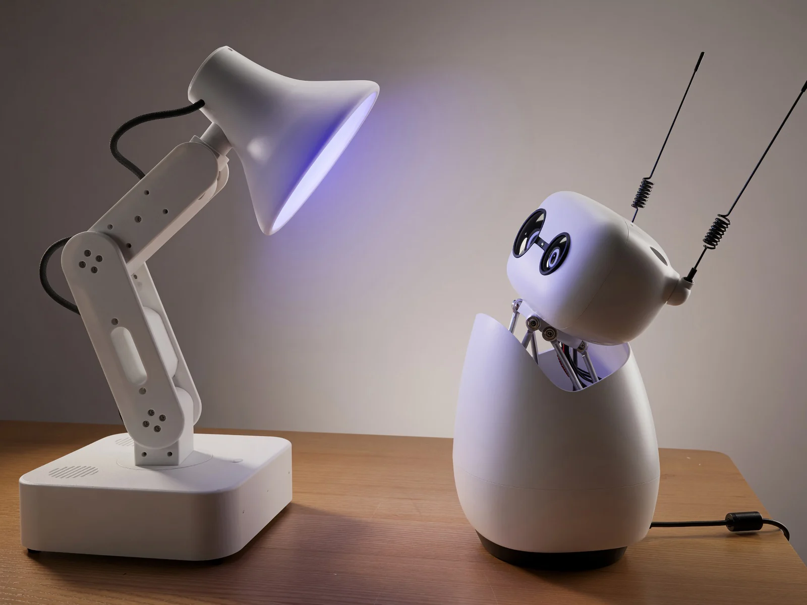

## Autonomous OS: The "Android" for Robots

Robots have been around for years but have never been autonomous — someone has to drive them with a remote, and they've stopped at scripted demos. Autonomous OS brings autonomy to robots: install it on your robot and it comes alive.

- **Your robot thinks.** Everything it sees and hears goes to an agentic reasoning engine running on the robot itself — [Hermes](runtimes/hermes/), [Claude Code](runtimes/claudecode/), or [whichever you choose](runtimes/) — that decides what to do next.
- **Your robot acts.** It [guards the house](skills/guard/), [knows your face](skills/face-enroll/), [follows you as you move](skills/servo-tracking/), [reads the mood on your face](skills/user-emotion-detection/), [sets the light](skills/scene/) — and does the desk work too: [Gmail, GitHub](skills/connectors/), [your Mac](skills/computer-use/). Each one is a [skill](skills/) — install more from the Skill Store, or write your own.
- **Your robot grows.** It has a built-in learning loop. It creates skills from experience, sharpens them as it uses them, keeps what it learns, searches its own past conversations, and builds a deeper picture of you with every session.

Autonomous OS is a fully customizable operating system for robots. Every component is swappable — [engine](runtimes/), [model](docs/hosted.md), [voice](hal/drivers/voice/), [skills](skills/), [board](hal/board/boards.json). Your robot declares what it has in a `DEVICE.md`, and the OS mounts exactly that. When a better one ships, your robot gets it the same day — and gets better without new hardware.

## Quick start

The simplest way in is a robot we have already tested it on. What each of them can do: [robot comparison](docs/robot-comparison.md). Want it on your own robot? [Follow this guide](docs/bring-your-own-robot.md).

### Autonomous Lamp


[Lamp](https://www.autonomous.ai/lamp) is the robot that shows the whole OS — it sees, hears, speaks, moves, and ships with Autonomous OS on it.

1. **Add it.** In the Autonomous app ([iOS](https://apps.apple.com/app/id6744885683) | [Android](https://play.google.com/store/apps/details?id=ai.autonomous.connect.wifi)), tap **Add robot → Lamp**.
2. **Set up Wi-Fi.** Pick your network in the app; it joins the robot's hotspot and hands over the keys and pairing.
3. **Interact with Lamp.** Say something, it turns to look at you, the ring lights up, and it answers.
4. **Install a skill** from the Skill Store — one tap, live on the next conversation.
5. **Build your own skill.** Type what you want it to do in the app and it writes the skill.
6. **Give it a character.** Edit [`SOUL.md`](devices/lamp/SOUL.md) and it is someone else on the next turn.

### Reachy Mini



[Reachy Mini](https://huggingface.co/docs/reachy_mini) is Hugging Face's desk robot, running our OS beside its own stack.

1. **SSH in** — `ssh pollen@reachy-mini.local`.
2. **Run one command.** Nothing is flashed; the Reachy daemon keeps the motors.
   ```bash
   curl -fsSL https://raw.githubusercontent.com/autonomous-ai/autonomous-os/main/devices/reachy-mini/install.sh | sudo bash
   ```
3. **Add it.** In the app, tap **Add robot → Reachy Mini** and give it `reachy-mini.local`.
4. **Interact with it.** Say something — the head tilts, the antennas lift, and it answers.
5. **Install a skill** from the Skill Store, or type what you want it to do and it writes one.
6. **Give it a character.** Edit `/opt/devices/reachy-mini/SOUL.md`. Everything else, including how to undo the install: [`devices/reachy-mini/README.md`](devices/reachy-mini/README.md).
7. **Put it next to a Lamp.** Each one hears the other's answer as its next input, so the two of them will hold a conversation until you stop them.

### Autonomous Intern


[Intern](https://www.autonomous.ai/intern) is the always-on desk agent: mic, speaker, LED ring.

1. **Add it.** In the app, tap **Add robot → Intern**.
2. **Set up Wi-Fi.** Same flow as Lamp: pick your network and it handles the keys and pairing.
3. **Interact with it.** Say something and it answers; the ring shows what it is doing.
4. **Install a skill** from the Skill Store — everything that needs no camera or servos runs here.
5. **Build your own skill.** Type what you want in the app; it is live on the next conversation.
6. **Give it a character.** Edit `/opt/devices/intern-v2/SOUL.md` — Intern runs the same image as Lamp with fewer capabilities declared, so everything else works the same way.

## Platform architecture

Autonomous OS is a software stack. Each layer uses only the layer below it, so any layer can be replaced without touching the others. Every layer is a folder in this repo.


### [Skills](skills/)

One folder per behavior, one `SKILL.md` inside: markdown the agent reads. A skill acts by writing `[HW:/path:{json}]` markers in its reply, so it never touches a servo bus or a GPIO pin. Each skill declares the capabilities it needs and installs on every robot that has them.

### [Agentic runtime](runtimes/)

The engine that thinks. Six of them — Hermes, OpenClaw, PicoClaw, Codex, Claude Code, OpenCode — behind one 76-method `AgentGateway`. It reads the robot's `SOUL.md` and its installed skills. Switch live from the web UI; persona, memory and connectors move with it.

### [System services](system/)

The Go daemon `os-server` on :5000, one package per box in the figure. `intent` answers fixed commands from a local table with no model; `server` strips `[HW:…]` markers out of a reply and POSTs them to HAL before the words are spoken; `agent` switches engines; `bootstrap` is OTA, its own binary.

### [Realtime voice](hal/realtime/)

Gemini Live, OpenAI Realtime or Qwen, hosted inside HAL and running beside the main path. A spoken turn lands here first: it answers directly, or hands the turn up to the engine.

### [Capabilities](devices/contract/capabilities.md)

The 13 names a robot may declare — audio, vision, sensing, presence, motion, light, display, expression, lifelike, media, connectivity, companion, system. Ten mount [HTTP routes](hal/routes/) on :5001 (111 endpoints, live Swagger at `/api/hardware/docs`); `presence` and `lifelike` are loops with no route, `companion` lives in os-server. HAL mounts only what `DEVICE.md` declares and fails loud on a missing required driver.

### [Safety gate](hal/safety/)

A pure function of `SAFETY.md`, below the engine and in every request path: brightness, quiet hours, explicit-move speed. No model in the loop — the same clamp whoever asked. What it does not cover yet: [`docs/safety.md`](docs/safety.md).

### [Drivers](hal/drivers/)

One folder per subsystem: motors, rgb, camera, voice, display, sensing, tracking, and the media handover a third-party daemon needs. New hardware is one class and one factory line.

### [Boards](hal/board/boards.json)

One JSON entry per board, matched against `/proc/device-tree/model`. Raspberry Pi 4, Pi 5, CM4 and OrangePi 4 Pro today. A new board is an entry, not a code change.

### Linux

The vendor kernel — Raspberry Pi OS, OrangePi Debian, or the robot's own image. We do not ship one, and nothing above the drivers has a real-time deadline: position control closes in the servo firmware, or in the robot's own daemon.

### [Bodies](devices/)

Four markdown files and a driver per robot. Declarations, not forks — a body is a PR.

Long form: [architecture](docs/architecture/overview.md) · [HAL](docs/architecture/hal.md) · [device spec](devices/contract/DEVICE-SPEC.md) · [capabilities](devices/contract/capabilities.md) · [safety](docs/safety.md) · [developer guide](docs/developer-guide.md).

## Contribute

PRs welcome, vibe-coded ones included — [`CONTRIBUTING.md`](CONTRIBUTING.md) has the norms, and the interface everyone builds on is [`devices/contract/`](devices/contract/), so open an issue before changing that. Questions, half-built ports and show-and-tell: [Discussions](https://github.com/autonomous-ai/autonomous-os/discussions).

| You want to… | You write… | Start from |
|---|---|---|
| Teach every robot something new | `skills/<name>/SKILL.md` | [`skills/guard/`](skills/guard/) · [`skill-creator`](skills/skill-creator/) |
| Run Autonomous on your robot | `devices/<id>/DEVICE.md` + `SAFETY.md` + `SOUL.md` | [`devices/reachy-mini/`](devices/reachy-mini/) — a third-party port, end to end |
| Support new hardware (open SDK) | a class in `hal/drivers/<subsystem>/` + one factory line | [`motors/reachy_service.py`](hal/drivers/motors/reachy_service.py) · [`camera/rpicam_capture_device.py`](hal/drivers/camera/rpicam_capture_device.py) |
| Support new hardware (closed SDK) | a small HTTP service speaking `MotionService` — [#204](https://github.com/autonomous-ai/autonomous-os/issues/204), not in-tree yet | [`base.py`](hal/drivers/motors/base.py) |
| Support a new board | one entry in `hal/board/boards.json` | [`boards.json`](hal/board/boards.json) |
| Add a brain | an `AgentGateway` implementation (76 methods, Go) in `runtimes/<name>/` + one factory case — the heaviest path | [`docs/agentic/adding-agent-runtime.md`](docs/agentic/adding-agent-runtime.md) · [`runtimes/opencode/`](runtimes/opencode/) |
| Ship an app people install with one click | a Python plugin against the plugin API | [`integrations/community-apps/plugin-template/`](integrations/community-apps/plugin-template/) · [plugin system](docs/plugin-system.md) |
| Add a voice — STT, TTS, or a realtime provider | a subclass in `hal/drivers/voice/` or `hal/realtime/voice_agent/` | [`voice_agent/qwen_realtime.py`](hal/realtime/voice_agent/qwen_realtime.py) |
| Turn a chat platform into a robot sense | a small Go program posting to `/api/sensing/event` (the web-chat bridge is ~230 lines) | [`integrations/chat-bridges/`](integrations/chat-bridges/) |
| Give the robot new eyes (a perception model) | a predictor in `integrations/perception-service/` or `hal/drivers/sensing/perceptions/` | [`perception-service/`](integrations/perception-service/) |
| Add a safety bound | a field + pure gate in `hal/safety/policy.py`, documented in [`SAFETY-SPEC.md`](devices/contract/SAFETY-SPEC.md) | [`policy.py`](hal/safety/policy.py) |
| Make the CTS stricter | a probe in `devices/contract/cts/` | [`test_runtime.py`](devices/contract/cts/test_runtime.py) |

### Running a fleet

Ten robots is the same install ten times. There is no fleet view, no per-device config and no inventory API — one robot per **Add robot**, every robot pulling the same skill feed and the same OTA floor. Point `OTA_METADATA_URL` at your own feed and you control exactly what ships and when. What will bite you, in order: the brains run as root beside `/dev/ttyACM0` ([#203](https://github.com/autonomous-ai/autonomous-os/issues/203)); OTA is unsigned zips over HTTPS every 5 min with no rollback ([#202](https://github.com/autonomous-ai/autonomous-os/issues/202)); the stop command commands a move — `/servo/release` travels to idle *then* cuts torque, and nothing aborts a move in flight, so no body here passes COMPATIBILITY rule 6 ([#201](https://github.com/autonomous-ai/autonomous-os/issues/201)). Until those land, keep a fleet on your own feed and off the public internet.

### Not built yet — claim one

Each is an open issue labelled [`claim-me`](https://github.com/autonomous-ai/autonomous-os/issues?q=is%3Aissue+is%3Aopen+label%3Aclaim-me); comment to take it. The first three flip the flywheel:

1. [**A mock body**](https://github.com/autonomous-ai/autonomous-os/issues/200) — `devices/sim/` on Pollen's `reachy-mini-daemon --sim` (same `:8000` API our driver already speaks) plus a `sim` board entry: a `DEVICE.md`, a board entry and glue, no new driver. **The day it merges: anyone with a laptop can run every skill in this repo — and Reachy Mini Lite works.**
2. [**Bring-your-own LLM endpoint for the OpenClaw brain**](https://github.com/autonomous-ai/autonomous-os/issues/198) — a base-URL + key override in `runtimes/openclaw/service_setup.go`, one config field and the call that reads it. The day it merges: a fully local robot, no account, Ollama on your LAN.
3. [**A skill catalog that reads `skills/`**](https://github.com/autonomous-ai/autonomous-os/issues/199) instead of a Go map (`Catalog` + `Capability` in one file), and CI publishing the feed on merge. The day it merges: "one folder, one PR, every robot" is literally true.

Seven more are open and labelled [`claim-me`](https://github.com/autonomous-ai/autonomous-os/issues?q=is%3Aissue+is%3Aopen+label%3Aclaim-me): a real `POST /servo/stop` ([#201](https://github.com/autonomous-ai/autonomous-os/issues/201)), signed OTA ([#202](https://github.com/autonomous-ai/autonomous-os/issues/202)), unprivileged runtimes ([#203](https://github.com/autonomous-ai/autonomous-os/issues/203)), an out-of-process motion driver ([#204](https://github.com/autonomous-ai/autonomous-os/issues/204)), the Go2-W port ([#205](https://github.com/autonomous-ai/autonomous-os/issues/205)), a LeRobot policy behind the marker ([#206](https://github.com/autonomous-ai/autonomous-os/issues/206)), and Reachy tracking, Hub moves and a dashboard app ([#207](https://github.com/autonomous-ai/autonomous-os/issues/207)).

More — a ROS 2 `MotionService`, x86 boards, route stability, a screen body, moving the contract's parsers out of GPL `hal/` — in [`docs/not-built-yet.md`](docs/not-built-yet.md).

Build locally:

```bash
make os-build && make os-test          # Go daemon, cross-compiled to linux/arm64
(cd hal && uv sync) && make hal-dev    # HAL on :5001 with reload
make web-install && make web-dev       # setup + monitor UI
make cts                               # is this a valid Autonomous device?
```

## License

Everything outside `hal/` is Apache-2.0. `hal/` is GPL-3.0 — a handful of modules, the `follower/` package and the teleop recordings are inherited from [LeLamp Runtime](https://github.com/humancomputerlab/lelamp_runtime) ([`hal/UPSTREAM.md`](hal/UPSTREAM.md) lists them); the rest of `hal/` is ours, kept GPL by choice so the tree has one license per top-level folder. A driver you commit there is GPL, so a closed vendor SDK wraps out of process. Security issues: [`SECURITY.md`](SECURITY.md).
