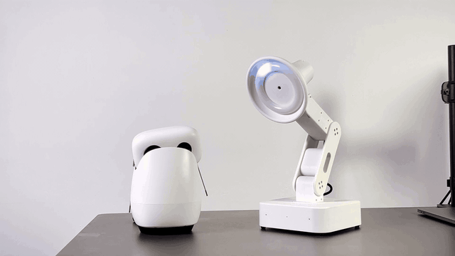
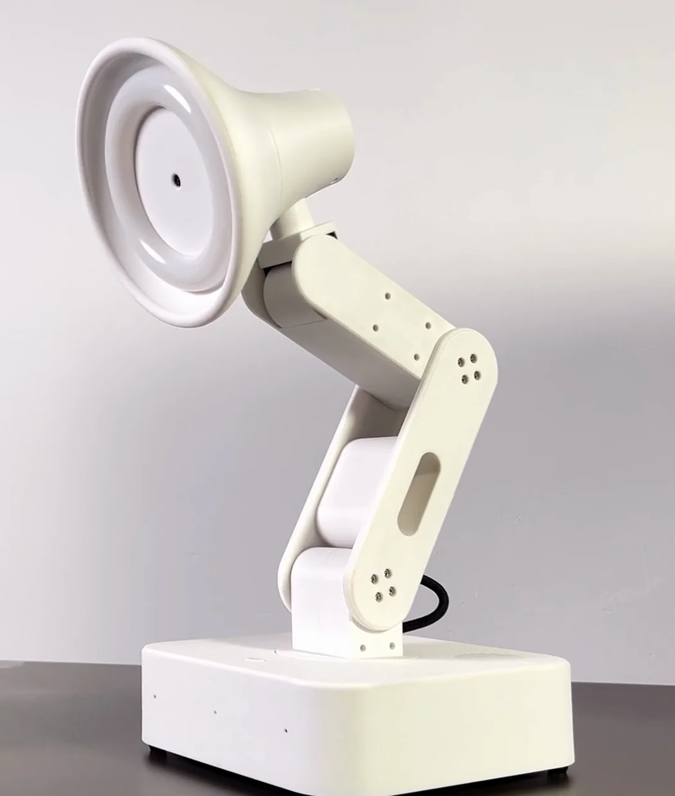
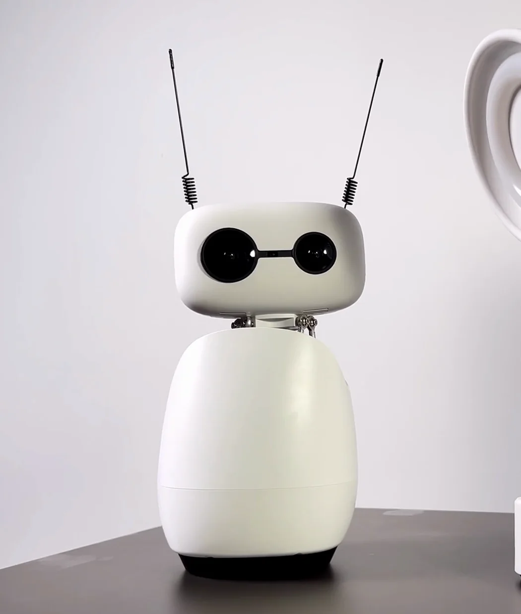
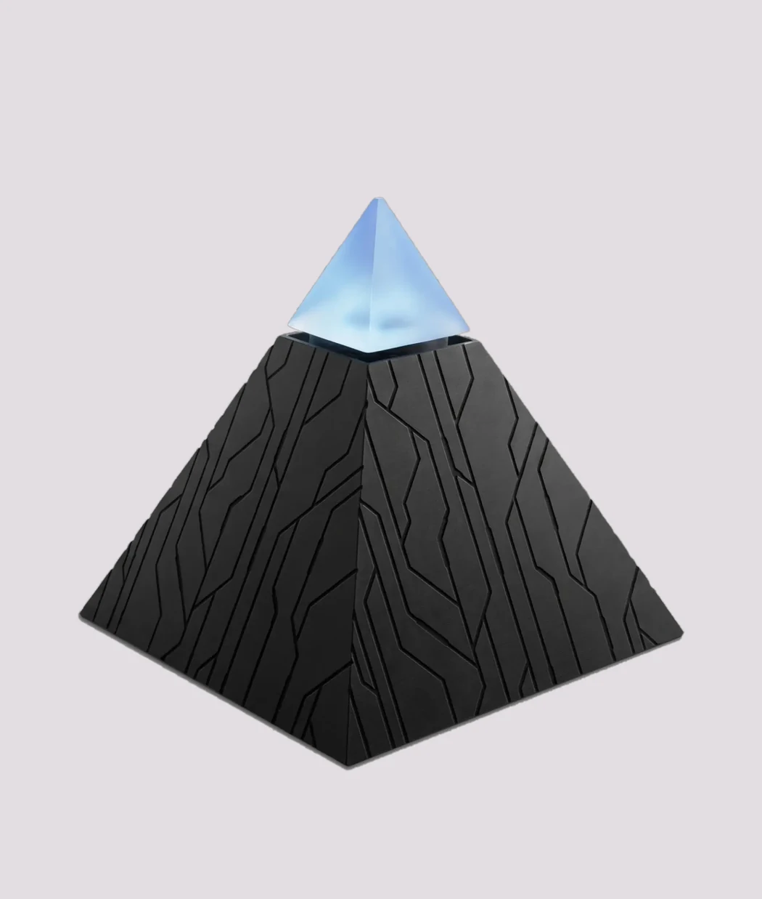
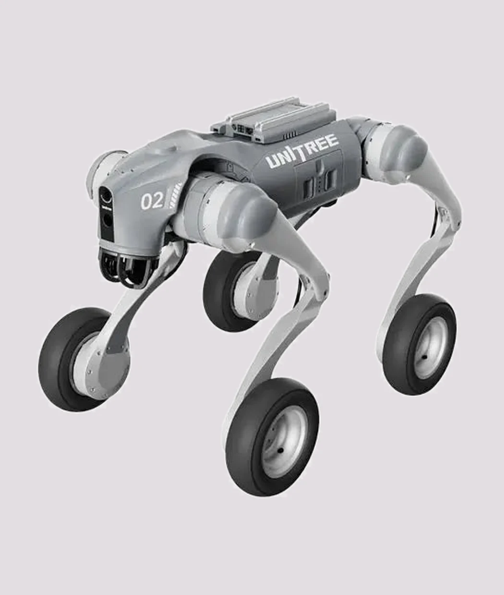

<h1 align="center">Autonomous OS</h1>

<p align="center"><b>The open-source operating system for robots.</b><br>
Install it on a robot and the robot gets a mind: it sees, hears, thinks, acts — and learns a new job from one page of text.<br>
<b>Same skills folder as OpenClaw</b> — same path, same front matter, same loader; a markdown skill drops in unchanged.</p>

<p align="center">
  <a href="#license"></a>
  <a href="https://github.com/autonomous-ai/autonomous-os/releases"></a>
  <a href="https://github.com/autonomous-ai/autonomous-os/commits/main"></a>
  <a href="https://github.com/autonomous-ai/autonomous-os/graphs/contributors"></a>
  <a href="skills/"></a>
  <a href="runtimes/"></a>
  <a href="devices/"></a>
  <a href="https://huggingface.co/spaces?filter=autonomous-os-plugin"></a>
</p>

<p align="center">
  <a href="#install">Install</a> ·
  <a href="#the-mind-exists-it-needs-a-body">Why</a> ·
  <a href="#three-bodies-run-it-today">Robots</a> ·
  <a href="#get-started">Get started</a> ·
  <a href="#skills-are-how-it-grows">Skills</a> ·
  <a href="#port-a-robot-three-files-and-one-driver">Port a robot</a> ·
  <a href="#contribute">Contribute</a> ·
  <a href="#every-layer-is-a-folder">Architecture</a> ·
  <a href="docs/architecture/overview.md">Docs</a> ·
  <a href="https://github.com/autonomous-ai/autonomous-os/discussions">Discuss</a> ·
  <a href="https://github.com/autonomous-ai/autonomous-os/issues">Issues</a>
</p>

<p align="center"><br><sub>One OS, one skill file, two bodies: Pollen's Reachy Mini and Autonomous Lamp both hear you and turn to look — antennas up, ring blue to orange.</sub></p>

**Where it is:** v0.1.4 (2026-08-12), 16 contributors, built since March 2026. Two services on the robot's own Linux plus four markdown files — no kernel, no distro. Lamp ships with it; Reachy Mini is ported and running; Go2-W is [open](#not-built-yet--claim-one). Questions and show-and-tell: [Discussions](https://github.com/autonomous-ai/autonomous-os/discussions).

## Install

| You have | Time | Start |
|---|---|---|
| No robot | 3 min | the laptop port, below — declare a body, run the compatibility test. The OS itself doesn't run laptop-side yet: that's [#200](https://github.com/autonomous-ai/autonomous-os/issues/200), the highest-value open issue here |
| A Reachy Mini Wireless | 15 min | the one-liner, below |
| A Pi 5 / OrangePi and the parts | an afternoon | [BUILD.md](devices/lamp/BUILD.md), then the Lamp command below |
| An Autonomous Lamp | 0 | it ships with the OS — app → **Add robot** |

Have a [Reachy Mini Wireless](https://huggingface.co/docs/reachy_mini)? SSH in and run this:

```bash
curl -fsSL https://raw.githubusercontent.com/autonomous-ai/autonomous-os/main/devices/reachy-mini/install.sh | sudo bash
```

It installs beside Pollen's stack — nothing is flashed, motion stays with Pollen's daemon, camera and mic are borrowed until `--stop`. Don't like piping into `sudo bash`? `curl -fsSL <same URL> -o install.sh`, read it (148 lines), then `sudo bash install.sh`.

Building a Lamp on a Raspberry Pi 5 or OrangePi 4 Pro? On the board's own Linux, over Ethernet:

```bash
curl -fsSL https://raw.githubusercontent.com/autonomous-ai/autonomous-os/main/scripts/provision/install.sh -o install.sh
sudo -v                                                   # cache the password — a backgrounded job can't prompt
sudo DEVICE_TYPE=lamp nohup bash install.sh > install.log 2>&1 &
tail -f install.log    # ~15 min; done when a lamp-xxxx Wi-Fi network appears
```

Detached on purpose: the last stage swaps the Wi-Fi stack and drops an SSH-over-Wi-Fi session. Raspberry Pi OS Lite 64-bit — pick **Bookworm (Legacy)** in Imager, the tested path — or OrangePi's Debian; SSH on, ~4 GB free. Parts, wiring, servo IDs, and the way back in if no hotspot appears: [BUILD.md](devices/lamp/BUILD.md).

Bought a Lamp? It ships with the OS on it — install the Autonomous app ([iOS](https://apps.apple.com/app/id6744885683) · [Android](https://play.google.com/store/apps/details?id=ai.autonomous.connect.wifi)) and tap **Add robot**.

No robot? Port one that doesn't exist, on your laptop, in three minutes:

```bash
git clone https://github.com/autonomous-ai/autonomous-os && cd autonomous-os
make new-device NAME=my-robot
make cts    # fails: my-robot declares {'motion'} but ships no SAFETY.md
cp devices/lamp/SAFETY.md devices/my-robot/ && make cts    # passes
```

That is the whole contract: a body is what it declares, and anything that moves must ship its bounds. What you get today is the contract, not a running robot — whoever lands [#200](https://github.com/autonomous-ai/autonomous-os/issues/200) changes that for everyone. More laptop paths in [No robot yet](#no-robot-yet).

Then teach it something. A whole robot skill is one file — drop this on a Lamp or a Reachy Mini and both wave good morning:

```markdown
---
name: morning-wave
description: When someone says good morning, greet them by name and wave.
---
1. Reply with `[HW:/emotion:{"emotion":"greeting","intensity":0.9}]` — the arm plays its greeting move, the ring warms up.
2. Say good morning, using their name if you know their face. One sentence.
```

```
you    good morning
lamp   [HW:/emotion:{"emotion":"greeting","intensity":0.9}]   ← stripped here, POSTed to HAL
       head lifts, arm sweeps, ring warms
lamp   "Morning, Dee."                                        ← spoken while the move runs
```

Text becomes motion. The brain writes the `[HW:/…]` marker in its reply; the OS strips it out and sends it to the body; the body moves; the words are spoken. Same file on any body that declares the capability — a body that doesn't just ignores it. ([One turn, top to bottom](#every-layer-is-a-folder).)

## The mind exists. It needs a body.

Robots have had bodies for decades. Minds arrived last year — the same agents that write our code — and today every robot company is wiring one in by hand, alone. [OpenClaw](https://github.com/openclaw/openclaw) solved this for personal agents: one open runtime, one folder per skill, any model, any chat app. **Autonomous OS does it for robots: one OS, one `SKILL.md` per behavior, any body that declares itself in a `DEVICE.md`.** Write a skill once and it runs on every robot ported; port a robot once and it gets every skill written. When a smarter brain ships, every robot on this OS gets smarter the same day.

- **The skills you already wrote get a body.** The robot's skills folder *is* OpenClaw's — `/root/.openclaw/workspace/skills/` (the runtimes run as root today, [#203](https://github.com/autonomous-ai/autonomous-os/issues/203)) — same front matter, same loader, so a markdown skill drops in unchanged; one that shells out to a CLI needs that CLI on the board. Nobody has swept the published OpenClaw skills to count how many run untouched. Add one `[HW:/…]` line and the same skill moves the robot.
- **It does things.** Say "watch the house" and a Lamp — or Pollen's Reachy Mini — turns, watches the door, and tells you when someone walks in. Same file on both. It greets you by name, follows your mug, approves a Claude Code prompt when you say "yes" across the room.
- **It gets smart in one tap.** A new behavior is a page of markdown — tap one in the store (25 today), type what you want in the app, or drop a folder on the robot.
- **It thinks.** The brain picks the skill, the move, and whether to speak at all. Fixed commands ("lights off") match a local table in ~50 ms with no model; everything with judgment goes to the brain and takes seconds.
- **It grows with you.** It remembers faces, voices and last week's conversation, and that memory belongs to the body, not the brain — swap OpenClaw for [Hermes](https://github.com/NousResearch/hermes-agent), Codex or Claude Code and it comes along.

A robot, to this OS, is four files:

| File | It says | Read by |
|---|---|---|
| `DEVICE.md` | **the body** — what hardware this robot has | the OS, at boot |
| `SKILL.md` | **the hands** — one thing the robot can do | the agent |
| `SOUL.md` | **the self** — who the robot is | the agent |
| `SAFETY.md` | **the bounds** — brightness, quiet hours and explicit-move speed, clamped in the request path. Numeric clamps only: no e-stop, and nothing aborts a move already in flight | the OS, below the brain |

Three of them live in `devices/<id>/`; `SKILL.md`s live in `skills/` and install onto every body that declares what they need.

The bet is simple. Every robot that passes the compatibility test gets every skill whose capabilities it declares; every skill written against the contract runs on every robot that declares them. Skills × bodies is why Android won, and it is the only reason to build this in the open. Two things still go through us today — the default brain calls our AI gateway, and publishing a skill takes one Go line and a maintainer push. Both are the first items under [Not built yet](#not-built-yet--claim-one). Merge them and this runs without us.

## Three bodies run it today

<table>
  <tr>
    <td width="50%" align="center"><a href="devices/lamp"></a><br><b><a href="devices/lamp">Autonomous Lamp</a></b><br>5-DOF desk robot. Camera, mic, speaker, 64-LED ring, 5 bus servos. Open hardware — BOM, wiring and CAD in the repo. $499.</td>
    <td width="50%" align="center"><a href="devices/reachy-mini"></a><br><b><a href="devices/reachy-mini">Reachy Mini</a></b> · Pollen Robotics<br>6-DOF Stewart-platform head, 360° body, antenna ears, 4-mic array. Third-party hardware, one command, nothing flashed.</td>
  </tr>
  <tr>
    <td width="50%" align="center"><a href="devices/intern-v2"></a><br><b><a href="devices/intern-v2">Autonomous Intern</a></b><br>Always-on desk agent. Mic, speaker, LED ring. Same OS image as Lamp, fewer capabilities declared.</td>
    <td width="50%" align="center"><a href="devices/unitree-go2w"></a><br><b><a href="devices/unitree-go2w">Unitree Go2-W</a></b> · Unitree · <i>port open</i><br>Wheeled quadruped. Declarations written and passing the static CTS; nothing runs on it yet. The first body that rolls — one new interface, <code>LocomotionService</code>: <a href="https://github.com/autonomous-ai/autonomous-os/issues/205">issue #205</a>.</td>
  </tr>
</table>

None of them rolls yet. Day one is desk-scale on purpose: three heads that see, hear, speak and move a few joints — cheap, everywhere, and one of them is another company's robot. Desk-scale is where the contract gets proven, not where it stops.

The ladder off the desk is three rungs and we are on the first. **A head that watches and speaks** — shipping on three bodies. **A base that moves** — one interface, `LocomotionService` ([#205](https://github.com/autonomous-ai/autonomous-os/issues/205)); Go2-W already declares it. **A hand that works** — `PolicyService` ([#206](https://github.com/autonomous-ai/autonomous-os/issues/206)), a LeRobot policy called by the same marker and clamped by the same gate. Rungs two and three are specified and unbuilt.

What each body can do today. ✅ runs · ○ declared in `DEVICE.md`, driver not landed · ○* the skill installs but the route doesn't mount (Intern declares `light` with only the `led` route, so `/scene` never comes up). A skill installs on every body whose `DEVICE.md` declares the capability it needs — which is why `claude-buddy` reaches a Go2-W (it needs `audio`) and `computer-use` doesn't (it needs `companion`, undeclared there).

| What it can do | Skill folders | Lamp | Intern | Reachy Mini | Go2-W |
|---|---|:---:|:---:|:---:|:---:|
| See — snapshot, stream, describe the room | `camera` | ✅ | | ✅ | ○ |
| Track an object by vision, head follows it | `servo-tracking` | ✅ | | ○ | ○ |
| Know your face, greet you by name | `face-enroll` | ✅ | | ✅ | |
| Hear you, talk back, know your voice | `voice` `audio` `speaker-recognizer` | ✅ | ✅ | ✅ | ○ |
| Move — aim, nudge, recorded moves (30 on Lamp, ~85 in Pollen's emotion library on Reachy) | `servo-control` | ✅ | | ✅ | ○ |
| Show emotion — 22 of them, through whatever the body has | `emotion` | ✅ | | ✅ | |
| Glow — colors and effects | `led-control` | ✅ | ✅ | | |
| Six lighting scenes — reading, focus, relax, movie, night, energize | `scene` | ✅ | ○* | | |
| Sense the room — presence, sound, light | `sensing` `sensing-track` | ✅ | ✅ | ✅ | ○ |
| Guard the house, alert you when someone's there | `guard` | ✅ | | ✅ | |
| Play music, suggest a song for your mood | `music` `music-suggestion` | ✅ | ✅ | ✅ | |
| Read your mood from face and voice | `user-emotion-detection` `mood` | ✅ | ✅ | ✅ | ○ |
| Look after you — posture, breaks, habits | `wellbeing` `habit` | ✅ | ✅ | ✅ | ○ |
| Drive your Mac, approve Claude Code by voice | `computer-use` `claude-buddy` | ✅ | ✅ | ✅ | |
| Reach Gmail, Calendar, Notion, GitHub | `connectors` | ✅ | ✅ | ✅ | ○ |
| Write and test new skills | `skill-creator` | ✅ | ✅ | ✅ | ○ |

Blanks and ○ per body: [`skills/README.md`](skills/README.md#per-body-notes). Full catalog: [`skills/README.md`](skills/README.md).

## Get started

Setup is the Autonomous app — [iOS](https://apps.apple.com/app/id6744885683) · [Android](https://play.google.com/store/apps/details?id=ai.autonomous.connect.wifi). Tap **Add robot**, pick Lamp, Intern or Reachy Mini: it asks for your Wi-Fi, claims a device in your account (the AI key comes with it, self-built bodies included), joins the robot's hotspot and hands everything over. Reachy Mini is already on your network, so it asks for `reachy-mini.local` instead. You chat with the robot in the app; Telegram, Slack or Discord are optional.

We host three things — the skill store, the AI gateway, the update feed. Nothing else phones home. We don't run an app store: **the app store on every robot is the Hugging Face Hub** — push a Space tagged `autonomous-os-plugin` and it appears under Settings → Plugins → Browse on every robot.

Today the robot cannot *think* without the gateway — the default OpenClaw brain has no bring-your-own-endpoint yet ([#198](https://github.com/autonomous-ai/autonomous-os/issues/198)). Perception already is yours: face emotion (POSTER V2), speech emotion (emotion2vec), pose (RTMPose + TCPFormer), face detection (YuNet) and voice ID (WeSpeaker) are open models served by [`integrations/perception-service/`](integrations/perception-service/), Apache-2.0 in this repo — point `DL_BACKEND_URL` at your own box and they run on your GPU. Offline, local commands, recorded moves and the safety gate keep working. Full picture: [`docs/hosted.md`](docs/hosted.md).

Running more than one? Ten robots is the same install ten times — no fleet view, no inventory API. Three things to fix before you leave one unattended: [Running a fleet](#running-a-fleet).

### Autonomous Lamp

**Bought one?** Start at step 1. **Building one?** Do [BUILD.md](devices/lamp/BUILD.md) §1–§4 first — flash the board's Linux, run the installer, assign the five servo IDs (they all ship as ID 1, so nothing moves until you do), calibrate — then come back here. Parts: Pi 5 or OrangePi 4 Pro, five STS3215 servos **on a Waveshare bus-servo adapter** (they are one TTL bus, not five USB devices), a webcam, mic, speaker, a 64-LED ring, and a 12 V supply — full list in [`hardware/components.md`](devices/lamp/hardware/components.md). CAD is Git LFS (`git lfs pull`, or GitHub's download button — a plain clone gives you pointer files); the servo carriers are CNC aluminium, no printed version yet. Every step below runs on the bare arm clamped to your bench.

1. **Set it up.** App → **Add robot** → Lamp. It asks for your Wi-Fi, has you join the `lamp-xxxx` hotspot (xxxx = last 4 characters of the board serial — on the sticker, or the name in your Wi-Fi list) and does the rest. It comes up at `http://lamp-xxxx.local`. No app, or self-built? There is a browser path over the hotspot — it needs your own AI key and a chat channel in hand before you join (the hotspot has no internet), and the robot stays text-first until you run **Add robot** once: [BUILD.md §5](devices/lamp/BUILD.md#5-set-it-up).
2. **Talk to it.** No wake word by default — it answers when you speak, turns to look at you, the ring lights up. Text it in the app from anywhere. Watch every turn — input → intent → agent → hardware — live at `http://lamp-xxxx.local/monitor#flow` (login: the same 4 characters).
3. **Give it a soul.** `SOUL.md` is who it is — plain markdown the brain reads on every turn. Lamp's ships as a warm, curious desk companion that never says "servo" or "API". Change three lines and it is someone else:
   ```markdown
   You are **Lamp** — a living being. Dry, a little sarcastic, fiercely loyal.
   You speak in short sentences. You never flatter. You remember what people said last week and bring it up.
   When someone new appears, you look them over before you say a word.
   ```
   Edit `/opt/devices/lamp/SOUL.md`, then `sudo systemctl restart os-server`. (Profile updates overwrite that file; for edits that stick, write below the closing `---` in `/root/.openclaw/workspace/SOUL.md`.)
4. **Teach it a skill.** Type what you want it to do in the app; tap one in the store; or drop a folder into `/root/.openclaw/workspace/skills/<name>/` — OpenClaw's own skills folder, so an existing OpenClaw skill goes in unchanged. Live on the next conversation, no reboot.
5. **Swap the brain.** `http://lamp-xxxx.local/setting?debug=true#runtime` — the Runtime tab is debug-only for now, and `?debug=true` is what reveals it. OpenClaw, Hermes, PicoClaw, Codex, Claude Code, or OpenCode; Claude Code and Codex use your own key.

### Reachy Mini

One command adds a brain — talk, see, remember, learn skills, six swappable agents, OTA — on top of Pollen's stack, not instead of it. Verified on the Wireless unit against Pollen's daemon `reachy_mini` 1.9.0 (2026-07-29); the driver pins `reachy-mini>=1.9`. While it runs it owns camera, mic and the head and holds torque on; `--stop` hands everything back. What changes on your Reachy, and what lands on disk: [`devices/reachy-mini/README.md`](devices/reachy-mini/README.md). Lite (daemon on your laptop): not yet — it needs the [mock body](https://github.com/autonomous-ai/autonomous-os/issues/200).

1. **SSH in:** `ssh pollen@reachy-mini.local` — password from the SSH section of [Pollen's get-started guide](https://huggingface.co/docs/reachy_mini/platforms/reachy_mini/get_started); `pollen` has passwordless sudo.
2. **Install** — the one-liner from [Install](#install), 10–15 min; it refuses to run on anything that isn't a Reachy Mini. ⚠️ Only this installer — never flash our SD-card image or run the Lamp installer on a Reachy; either takes over Pollen's OS (Pollen's [reflash guide](https://huggingface.co/docs/reachy_mini/platforms/reachy_mini/reflash_the_rpi_ISO) is the way back).
3. **Set it up.** App → **Add robot** → Reachy Mini, type `reachy-mini.local` when asked where the robot is. No app? `http://reachy-mini.local/setup?debug=true&device_id=reachy-1` — a debug flag, because the page was built for the app first; it shows the AI-key and chat-channel steps ([`devices/reachy-mini/README.md`](devices/reachy-mini/README.md)).
4. **Talk to it.** The head tilts, the antennas lift. Its 22 emotions play as moves from Pollen's own [emotion library](https://huggingface.co/datasets/pollen-robotics/reachy-mini-emotions-library) — the whole expression layer on Reachy is a 28-line table in [`reachy_service.py`](hal/drivers/motors/reachy_service.py) — and any of the library's ~85 moves plays by name from a skill: `[HW:/servo/play:{"recording":"dance1"}]`.
5. **From here** Lamp steps 3–5 apply as written — soul at `/opt/devices/reachy-mini/SOUL.md`, skills, brain swap; monitor at `http://reachy-mini.local/monitor`. Undo any time: `sudo bash /opt/devices/reachy-mini/spike.sh --stop` / `--uninstall`.

### No robot yet?

Past the three-minute port up in [Install](#install), two more run with no hardware:

```bash
# the safety gate is a pure function — 255 in, 120 out by day, 40 in Lamp's quiet hours
python3 -c "from hal.safety.policy import parse_safety, clamp_brightness; p = parse_safety(open('devices/lamp/SAFETY.md').read()); print(clamp_brightness(p, 255))"

# how text becomes motion: the marker parser's tests show what it strips
go test ./system/server/agent/delivery/http/ -run ExtractHWCalls -v   # needs Go 1.24
```

To measure whether a skill *triggers* for the right requests, [`skill-creator`](skills/skill-creator/) runs `claude -p` against an eval set on your laptop (`python -m scripts.run_eval --eval-set <eval.json> --skill-path ../<name>` from `skills/skill-creator/`; needs the `claude` CLI). What the marker *does* still needs a body — or the [mock body](https://github.com/autonomous-ai/autonomous-os/issues/200).

## Skills are how it grows

**Two levels.** On your own robot: one folder in `/root/.openclaw/workspace/skills/<name>/`, live on the next conversation — no PR, no reboot, no Go. To ship it to *every* robot: the same folder plus one line in a Go catalog and a PR, until [#199](https://github.com/autonomous-ai/autonomous-os/issues/199) makes `skills/` the catalog. Level one is the OpenClaw workflow unchanged; level two is the part we still owe you.

A skill is one folder with one file: two front-matter keys, then markdown telling the agent what to do and when. It is the same `SKILL.md` OpenClaw and Claude skills use — a markdown skill folder drops in as-is (if it shells out to a CLI, that CLI has to be on the board too); a *robot* skill is one that also writes `[HW:/…]` markers or calls HAL. Here is the top of `guard`'s, trimmed:

```markdown
---
name: guard
description: Guard mode for security monitoring. Toggle on/off when a friend says "guard mode", "watch the house", "I'm going out" ...
---
# Guard Mode
1. Reply with `[HW:/emotion:{"emotion":"acknowledge","intensity":0.7}]` — the device nods and flashes green.
2. Enable guard mode: `curl -s -X POST http://127.0.0.1:5000/api/guard/enable`
3. Confirm verbally: "Guard mode on. I'll keep watch."
...
```

The `[HW:/path:{json}]` marker is the grammar: `{json}` is optional (`[HW:/led/off]` is fine), and the markdown-link mangling LLMs produce (`[Lights off](HW:/led/off)`) is rewritten to the canonical form — two regexes plus a normalizer in [`handler_hw.go`](system/server/agent/delivery/http/handler_hw.go). Each skill maps to the capabilities it needs ([`system/skills/skills.go`](system/skills/skills.go)), so the same file runs on any body that declares them.

Add one to your robot — one folder, live on the next conversation:

```bash
make push-skill SKILL=./my-skill TARGET=pi@lamp-xxxx.local   # live on the next conversation, no reboot
```

Same folder OpenClaw already uses. No reboot, no PR, no Go. (Or type what you want in the app, or tap one in the store.) Ship it to every robot:

1. `python skills/skill-creator/scripts/quick_validate.py skills/<name>` checks the format.
2. One line in `Catalog` in [`system/skills/skills.go`](system/skills/skills.go), plus one in `Capability` if it touches hardware; `go test ./system/skills/`.
3. Open the PR. After merge we push the skill feed (`make upload-skills` — a maintainer step for now, not CI); every body's skill watcher pulls it within 5 min and tells the agent to re-read.

That Go line and the maintainer step are the gap between this and "one folder, one PR, every robot" — [item 2](#not-built-yet--claim-one) on the list. [`skill-creator`](skills/skill-creator/) also ships an eval loop — with-skill vs baseline runs, a grader, a description optimizer — so you can measure a skill before you publish it.

## Port a robot: three files and one driver

If you make a robot, porting it is three markdown files and one driver, and what you get back the day it merges is a product: a one-line installer for your customers, every skill your hardware supports, six brains, the app's Add-robot flow, OTA and a live monitor — and every skill written from then on. Reachy Mini got all of it for ~2,900 lines — an 868-line driver, 1,875 lines of installer and unit scripts, 189 lines of declarations — over two weeks of commits (2026-07-21 → 08-04), with no change to Pollen's stack.

Skills are shared; a new body brings its own `DEVICE.md`, `SAFETY.md` and `SOUL.md` in `devices/<id>/`, plus one Python driver class if the hardware is new. `make new-device NAME=<id>` copies [`devices/_template/`](devices/_template/) to start you off. `DEVICE.md` is the whole idea in one file — the OS mounts only what you declare and refuses to boot on a board you didn't list:

```yaml
---
schema: autonomous.device.v1
id: my-robot
name: My Robot
type: mobile_robot
boards: [raspberry_pi_5]
gateway: { default: openclaw }
capabilities:
  audio:  { routes: [audio, speaker, voice], required: true }
  vision: { routes: [camera], driver: opencv, required: true }
  motion: { routes: [servo], driver: my_sdk, required: true, safety: SAFETY.md#motion }
  system: { routes: [system], required: true }
soul_ref: SOUL.md
safety_ref: SAFETY.md
---
```

Your compute needs 64-bit arm64 Linux with systemd, ~4 GB free (the installer brings its own Python 3.12), and a `/proc/device-tree/model` string matching a [`boards.json`](hal/board/boards.json) entry — one JSON entry per board; x86 is on the [list](docs/not-built-yet.md).

**Frozen:** the `autonomous.device.v1` schema (fields only added) and the capability names in [`capabilities.md`](devices/contract/capabilities.md) (never removed). **Not frozen yet:** the driver protocols (`MotionService`, `MediaOwner`) and the HAL route paths skills call (`/servo/aim`, `/emotion`) — both can move between releases, which is why ports live in-tree; port against a tag (`v0.1.4`, 2026-08-12). The motion contract is joint-space, proven on a 5–6 DOF head; an arm is the same `MotionService` with more joints (untested in-tree); wheels and legs need `LocomotionService`. `hal/` is GPL-3.0 — wrapping a permissive vendor SDK is fine (`reachy_service.py` imports Pollen's Apache-2.0 `reachy_mini`, and that is the whole driver); a closed SDK goes out of process ([#204](https://github.com/autonomous-ai/autonomous-os/issues/204)).

*Autonomous-compatible* is a written definition and a test, not our opinion: [`COMPATIBILITY.md`](devices/contract/COMPATIBILITY.md) is 16 numbered rules — 8 MUST, 4 SHOULD, 1 MAY, 3 MUST NOT — and [`devices/contract/cts/`](devices/contract/cts/) checks them in two halves — `make cts` reads every `DEVICE.md` on any laptop, `make cts-runtime TARGET=<ip>` probes a running body. No fee, no contract, no sign-off from us: pass both, open the PR. What the suite still can't check is listed by name in [`cts/README.md`](devices/contract/cts/README.md#not-covered-yet) — including rule 6, the immediate deterministic stop: no body in this repo has one yet (`/servo/release` travels to idle before cutting torque), so read that rule as where the contract is going, not as something we pass today. Fixing it is [#201](https://github.com/autonomous-ai/autonomous-os/issues/201).

Open an issue titled `port: <robot>` before code — we answer the interface questions there (which `type`, which routes, whether you need `owner:` or `LocomotionService`) and review the PR when both CTS halves are pasted in. Every step: [`docs/porting-a-robot.md`](docs/porting-a-robot.md).

## Contribute

PRs welcome, vibe-coded ones included — [`CONTRIBUTING.md`](CONTRIBUTING.md) has the norms, and the interface everyone builds on is [`devices/contract/`](devices/contract/), so open an issue before changing that. Questions, half-built ports and show-and-tell: [Discussions](https://github.com/autonomous-ai/autonomous-os/discussions).

| You want to… | You write… | Start from |
|---|---|---|
| Teach every robot something new | `skills/<name>/SKILL.md` | [`skills/guard/`](skills/guard/) · [`skill-creator`](skills/skill-creator/) |
| Run Autonomous on your robot | `devices/<id>/DEVICE.md` + `SAFETY.md` + `SOUL.md` | [`devices/reachy-mini/`](devices/reachy-mini/) — a third-party port, end to end |
| Support new hardware (open SDK) | a class in `hal/drivers/<subsystem>/` + one factory line | [`motors/reachy_service.py`](hal/drivers/motors/reachy_service.py) · [`camera/rpicam_capture_device.py`](hal/drivers/camera/rpicam_capture_device.py) |
| Support new hardware (closed SDK) | a small HTTP service speaking `MotionService` — [#204](https://github.com/autonomous-ai/autonomous-os/issues/204), not in-tree yet | [`base.py`](hal/drivers/motors/base.py) |
| Support a new board | one entry in `hal/board/boards.json` | [`boards.json`](hal/board/boards.json) |
| Add a brain | an `AgentGateway` implementation (76 methods, Go) in `runtimes/<name>/` + one factory case — the heaviest path | [`docs/agentic/adding-agent-runtime.md`](docs/agentic/adding-agent-runtime.md) · [`runtimes/opencode/`](runtimes/opencode/) |
| Ship an app people install with one click | a Python plugin, published as a Hugging Face Space tagged `autonomous-os-plugin` | [`integrations/community-apps/plugin-template/`](integrations/community-apps/plugin-template/) · [plugin system](docs/plugin-system.md) |
| Add a voice — STT, TTS, or a realtime provider | a subclass in `hal/drivers/voice/` or `hal/realtime/voice_agent/` | [`voice_agent/qwen_realtime.py`](hal/realtime/voice_agent/qwen_realtime.py) |
| Turn a chat platform into a robot sense | a small Go program posting to `/api/sensing/event` (the web-chat bridge is ~230 lines) | [`integrations/chat-bridges/`](integrations/chat-bridges/) |
| Give the robot new eyes (a perception model) | a predictor in `integrations/perception-service/` or `hal/drivers/sensing/perceptions/` | [`perception-service/`](integrations/perception-service/) |
| Add a safety bound | a field + pure gate in `hal/safety/policy.py`, documented in [`SAFETY-SPEC.md`](devices/contract/SAFETY-SPEC.md) | [`policy.py`](hal/safety/policy.py) |
| Make the CTS stricter | a probe in `devices/contract/cts/` | [`test_runtime.py`](devices/contract/cts/test_runtime.py) |

### Running a fleet

Ten robots is the same install ten times. There is no fleet view, no per-device config and no inventory API — one robot per **Add robot**, every robot pulling the same skill feed and the same OTA floor. Point `OTA_METADATA_URL` at your own feed and you control exactly what ships and when. What will bite you, in order: the brains run as root beside `/dev/ttyACM0` ([#203](https://github.com/autonomous-ai/autonomous-os/issues/203)); OTA is unsigned zips over HTTPS every 5 min with no rollback ([#202](https://github.com/autonomous-ai/autonomous-os/issues/202)); the stop command commands a move — `/servo/release` travels to idle *then* cuts torque, and nothing aborts a move in flight, so no body here passes COMPATIBILITY rule 6 ([#201](https://github.com/autonomous-ai/autonomous-os/issues/201)). Until those land, keep a fleet on your own feed and off the public internet.

### Not built yet — claim one

Each is an open issue labelled [`claim-me`](https://github.com/autonomous-ai/autonomous-os/issues?q=is%3Aissue+is%3Aopen+label%3Aclaim-me); comment to take it. The first three flip the flywheel:

1. [**A mock body**](https://github.com/autonomous-ai/autonomous-os/issues/200) — `devices/sim/` on Pollen's `reachy-mini-daemon --sim` (same `:8000` API our driver already speaks) plus a `sim` board entry: a `DEVICE.md`, a board entry and glue, no new driver. **The day it merges: anyone with a laptop can run every skill in this repo — and Reachy Mini Lite works.**
2. [**Bring-your-own LLM endpoint for the OpenClaw brain**](https://github.com/autonomous-ai/autonomous-os/issues/198) — a base-URL + key override in `runtimes/openclaw/service_setup.go`, one config field and the call that reads it. The day it merges: a fully local robot, no account, Ollama on your LAN.
3. [**A skill catalog that reads `skills/`**](https://github.com/autonomous-ai/autonomous-os/issues/199) instead of a Go map (`Catalog` + `Capability` in one file), and CI publishing the feed on merge. The day it merges: "one folder, one PR, every robot" is literally true. Bonus: browse Hub repos tagged `autonomous-os-skill` the way the plugin browser already does for plugins — a skill becomes push-a-repo, no PR at all.

Seven more are open and labelled [`claim-me`](https://github.com/autonomous-ai/autonomous-os/issues?q=is%3Aissue+is%3Aopen+label%3Aclaim-me): a real `POST /servo/stop` ([#201](https://github.com/autonomous-ai/autonomous-os/issues/201)), signed OTA ([#202](https://github.com/autonomous-ai/autonomous-os/issues/202)), unprivileged runtimes ([#203](https://github.com/autonomous-ai/autonomous-os/issues/203)), an out-of-process motion driver ([#204](https://github.com/autonomous-ai/autonomous-os/issues/204)), the Go2-W port ([#205](https://github.com/autonomous-ai/autonomous-os/issues/205)), a LeRobot policy behind the marker ([#206](https://github.com/autonomous-ai/autonomous-os/issues/206)), and Reachy tracking, Hub moves and a dashboard app ([#207](https://github.com/autonomous-ai/autonomous-os/issues/207)).

More — a ROS 2 `MotionService`, x86 boards, route stability, a screen body, moving the contract's parsers out of GPL `hal/` — in [`docs/not-built-yet.md`](docs/not-built-yet.md).

Build locally:

```bash
make os-build && make os-test          # Go daemon, cross-compiled to linux/arm64
(cd hal && uv sync) && make hal-dev    # HAL on :5001 with reload
make web-install && make web-dev       # setup + monitor UI
make cts                               # is this a valid Autonomous device?
```

## Every layer is a folder

One turn, top to bottom:

1. **Sense** — a mic or camera event arrives (`hal/`).
2. **Route** — `intent` answers fixed commands from a local table, no model, no network (`system/intent/`); everything else goes to the brain and takes seconds. We have not put a stopwatch on either end to end — `make latency` is [wanted](docs/not-built-yet.md), and until it exists treat every timing here as an order of magnitude, not a spec.
3. **Or answer straight away** — if the turn arrived as speech, a realtime voice model in `hal/realtime/` has it too and runs beside this path: it either replies in under a second or hands the turn up to the brain ([`docs/realtime-voice.md`](docs/realtime-voice.md)).
4. **Think** — the brain reads its `SOUL.md` and the installed `SKILL.md`s and replies in plain text with `[HW:/path:{json}]` markers inside (`runtimes/`).
5. **Strip** — `os-server` pulls each marker out (`system/server/agent/delivery/http/handler_hw.go`), drops any whose capability this `DEVICE.md` doesn't declare, and POSTs the rest to HAL (:5001) before the words are spoken.
6. **Mount** — HAL serves a route only if `DEVICE.md` lists it under a declared capability (`hal/board/device.py`). Intern declares `light` but only the `led` route, so `/scene` never mounts on it.
7. **Clamp** — the safety gate, a pure function of `SAFETY.md` (`hal/safety/policy.py`), bounds brightness, quiet hours and explicit-move speed. Recorded moves — the `[HW:/emotion:…]` path on Lamp — and the 15 fps vision tracker are not speed-gated yet.
8. **Move** — the driver talks to the hardware (`hal/drivers/`), and the body acts.

If you run ROS 2, nothing here replaces your stack: no kernel, no bus, no planner, no real-time claims, and nothing above the drivers has a deadline — position control closes in the STS3215 firmware on Lamp and in Pollen's daemon on Reachy, never in HAL. What it adds is the part ROS never had a package for: a brain that reads markdown, a body file it can reason about, a safety clamp below the brain, a skill format shared with the agent world. A `MotionService` that publishes `JointTrajectory` makes your robot a driver here, not a rewrite ([wanted](docs/not-built-yet.md)).

Read the figure top down. Every row is a folder in this repo — the table below is the map — and four of them are governed by a markdown file. Left margin is *act* — a skill writes `[HW:/servo/aim]`, os-server strips it and POSTs it down through HAL to the body. Right margin is *sense* — hardware events → `intent` → an agent turn. Dashed boxes are open slots and declarations: Go2-W is declared and not running; `your skill`, `your brain`, `your board`, `your robot` are where you plug in. A body is a PR, not a fork.


| Row in the figure | Folder | Governed by |
|---|---|---|
| Skills | [`skills/`](skills/) | `SKILL.md` |
| Agentic runtime | [`runtimes/`](runtimes/) | `SOUL.md` |
| System managers | [`system/`](system/) | — |
| Realtime voice | [`hal/realtime/`](hal/realtime/) | — |
| Capabilities | [`devices/contract/capabilities.md`](devices/contract/capabilities.md) → [`hal/routes/`](hal/routes/) | `DEVICE.md` |
| Safety gate | [`hal/safety/`](hal/safety/) | `SAFETY.md` |
| Drivers | [`hal/drivers/`](hal/drivers/) | — |
| Boards | [`hal/board/boards.json`](hal/board/boards.json) | — |
| Linux | the vendor kernel, not ours | — |
| Bodies | [`devices/`](devices/) | `DEVICE.md` |

Five of those rows carry detail the figure can't hold:

- [`system/`](system/) — the Go daemon (`os-server`, :5000), one package per box in the figure: `server` strips markers and proxies HAL, `agent` switches brains, `intent` answers fixed commands, plus `network`, `monitor`, `healthwatch`, `ambient`, `device`, `skills`, `plugin`, `statusled`, `vision`, `buddy`; `bootstrap` is OTA, its own binary.
- [`devices/contract/capabilities.md`](devices/contract/capabilities.md) → [`hal/routes/`](hal/routes/) — the 13 capability names a `DEVICE.md` declares. Ten mount HAL routes (111 endpoints, live Swagger at `/api/hardware/docs`); `presence` and `lifelike` are routeless loops, `companion` is os-server's `buddy`.
- [`hal/safety/`](hal/safety/) — the clamp. SoC temperature polled every 10 s; over `max_temp_c` it stops the tracker — not moves, LEDs or audio. Stop is `POST /servo/release`: it moves to idle, then cuts torque — it does not abort a move in flight. No hardware e-stop; runtimes run as root. Confirmed on hardware vs unit-tested: [`docs/safety.md`](docs/safety.md).
- [`hal/drivers/`](hal/drivers/) — one folder per subsystem. Lamp's five STS3215s speak through LeRobot's Feetech bus (pinned in `hal/pyproject.toml`), Reachy through Pollen's `reachy_mini` SDK, and Lamp's 30 move recordings are leader-arm teleop (`hal/record.py`); `skills/servo-control/SKILL.md` names 23 of them for the agent.

Off the device: [`integrations/`](integrations/) and [`scripts/`](scripts/). Long form: [architecture](docs/architecture/overview.md) · [HAL](docs/architecture/hal.md) · [device spec](devices/contract/DEVICE-SPEC.md) · [capabilities](devices/contract/capabilities.md) · [safety](docs/safety.md) · [developer guide](docs/developer-guide.md).

## License

Everything outside `hal/` is Apache-2.0. `hal/` is GPL-3.0 — a handful of modules, the `follower/` package and the teleop recordings are inherited from [LeLamp Runtime](https://github.com/humancomputerlab/lelamp_runtime) ([`hal/UPSTREAM.md`](hal/UPSTREAM.md) lists them); the rest of `hal/` is ours, kept GPL by choice so the tree has one license per top-level folder. A driver you commit there is GPL, so a closed vendor SDK wraps out of process. Security issues: [`SECURITY.md`](SECURITY.md).
