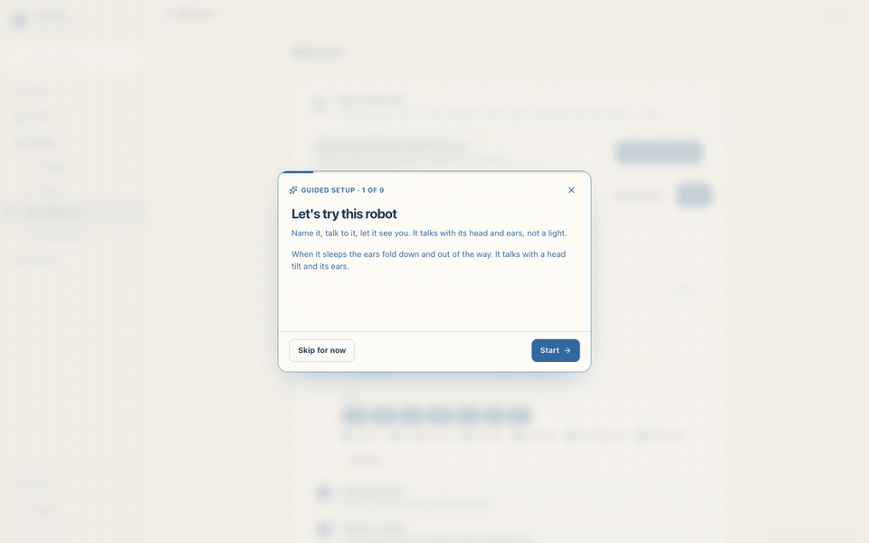
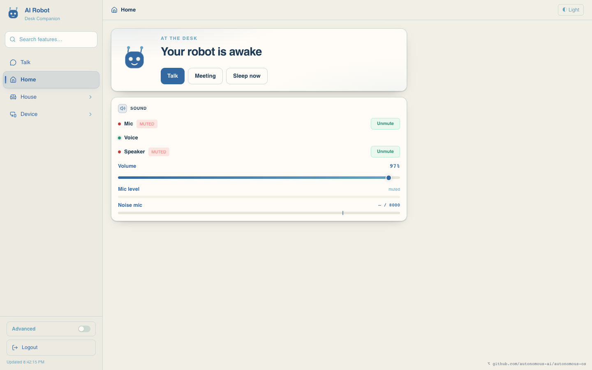
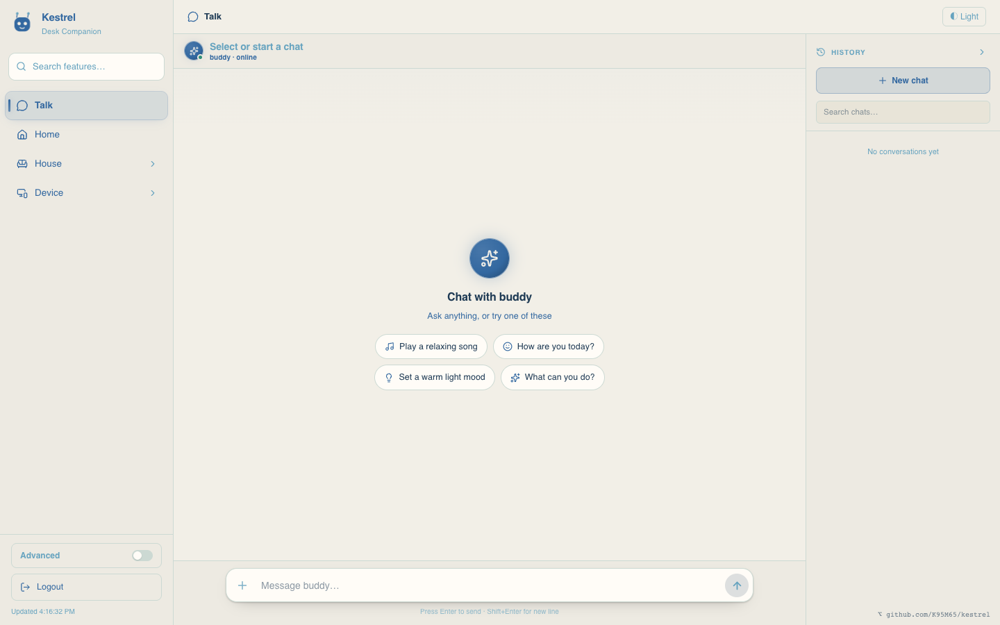
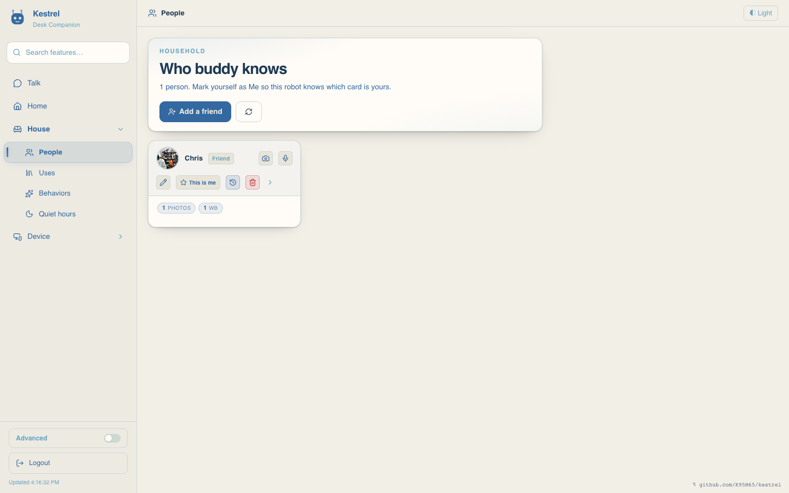
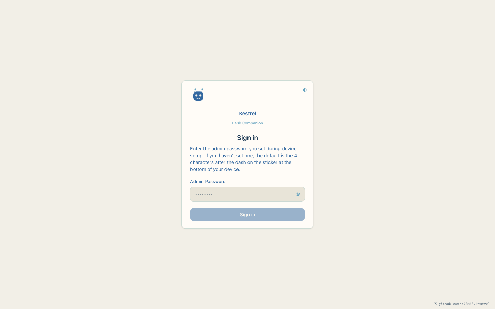
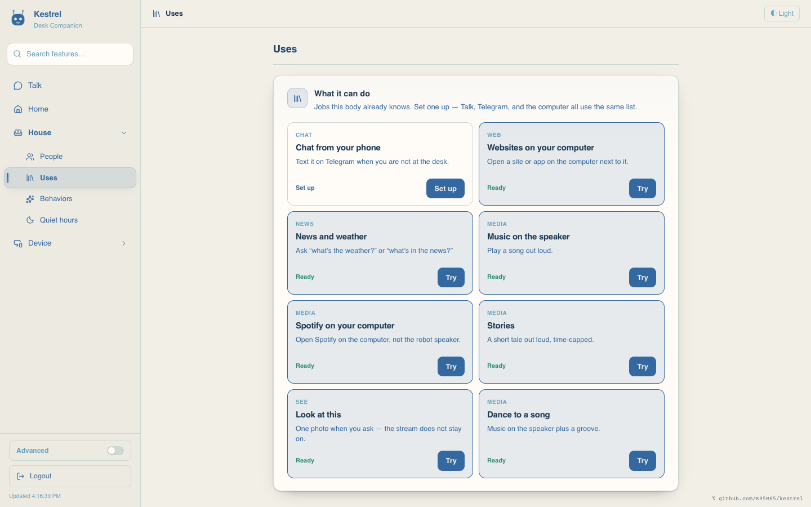
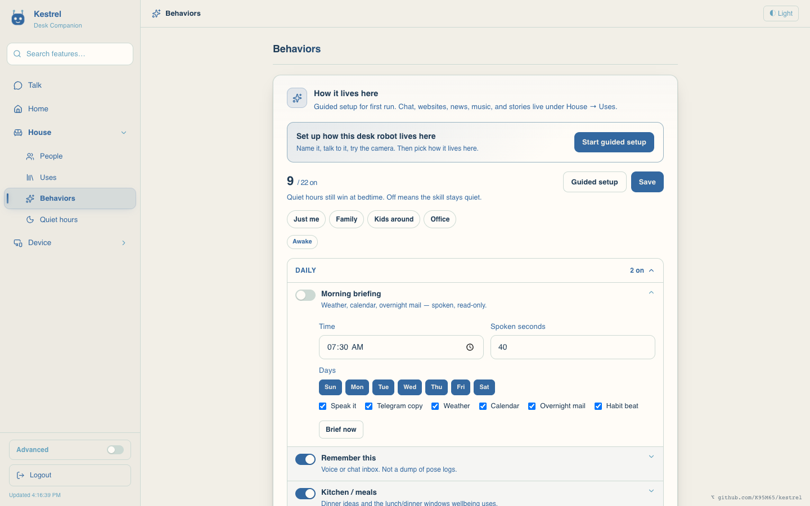
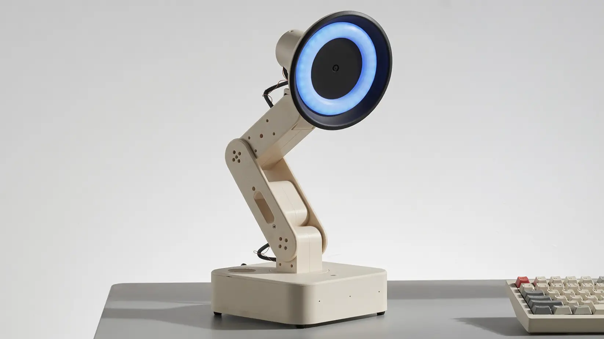
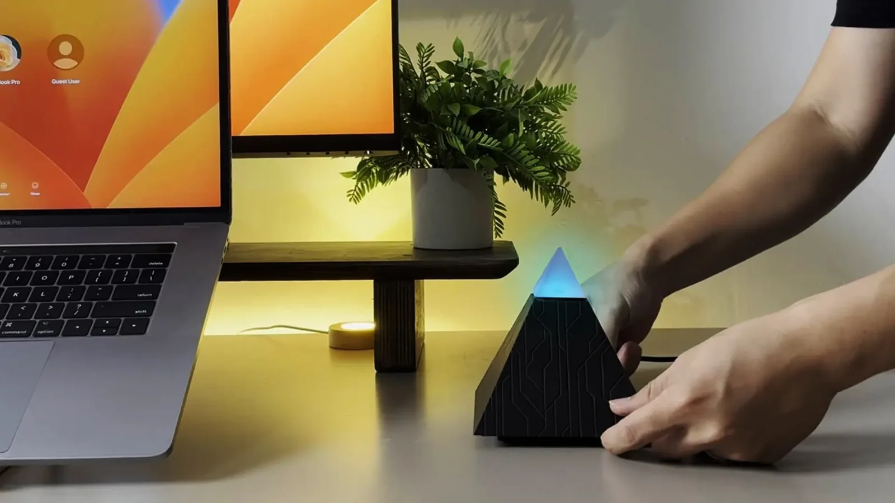
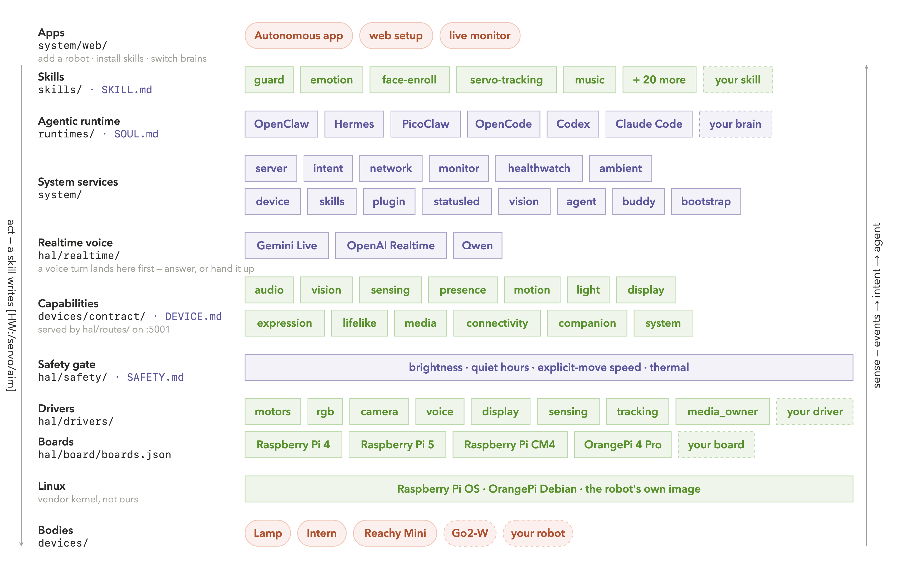

# Kestrel

Desk companion OS for robots — **Talk, Home, House, Device**. A fork of [Autonomous OS](https://github.com/autonomous-ai/autonomous-os).

Kestrel is this product. Autonomous OS is the upstream stack (HAL, skills, Hermes / OpenClaw, the `ROBOT.md` contract). We keep that contract. We change what a person at the desk actually uses.

**In-app Guide** (Device → Guide) is the home-user handbook. The same pages live in [`docs/wiki/`](docs/wiki/). Builder docs stay in [`docs/`](docs/).

| | |
|---|---|
| This repo | [K95M65/kestrel](https://github.com/K95M65/kestrel) |
| Upstream | [autonomous-ai/autonomous-os](https://github.com/autonomous-ai/autonomous-os) |
| File-level overlay | [`docs/divergence-from-stock.md`](docs/divergence-from-stock.md) |

---

## What makes this fork different

Stock Autonomous OS is a **device-agnostic robot OS**. Lamp, Intern, and Reachy Mini are bodies. Setup and chrome assume the Autonomous phone app and a Monitor + Settings dump.

Kestrel is a **desk companion** on that same OS. The robot serves its own product. You name it, talk to it, and give it a life at the desk — without flashing the body or joining an Autonomous account.

### Guided setup

Name it, talk to it, let it see you, pick who it is for (Just me / Family / Kids / Office), then mornings.

<p align="center">
  
</p>

### Rooms

Talk, Home, House, Device. Hardware, runtime, and MQTT stay behind Advanced / `?debug=true`. Ocean on cream (`#3368A0` / `#F2EFE7`), not stock lamp amber.

| Home — quiet hours + uses | Talk |
| --- | --- |
|  |  |

| House — People | Sign in |
| --- | --- |
|  |  |

### Unique to this fork

**Uses** is an OS-owned catalog the brains consume (they do not invent it): chat from your phone, websites on the computer, news and weather, speaker music vs Spotify on the computer, stories, look, dance. Each use has its own onboarding.

**Behaviors** is how it lives here — life presets and the guided setup, not a Settings dump.

| Uses | Behaviors |
| --- | --- |
|  |  |

**It has a name.** Rename writes `IDENTITY.md` and resets the brain session so the next turn is not still “Reachy.” Wake chips are `hey {name}`.

**People is a contact book.** Live add-a-friend, photo and voice on the person — not a Device tab of embeddings.

**Kestrel Buddy on the computer you actually use.** Mac menu bar, plus Windows and Linux desktop. Same pairing code from Home. The robot opens sites and apps *there*. (A phone app is a different job — Talk from elsewhere — and is still Telegram today.)

**Grok as a first-class brain.** Device-code login with a SuperGrok account. Hermes, OpenClaw, Codex, Claude Code, and the others stay swappable.

**Claim it like a Home accessory.** Home shows a setup code and QR. Scan `/claim` on the same Wi-Fi. That person is the owner. It does not join Apple Home or Google Home.

**Sign in with Google for mail and calendar** (TV-style code + QR). Skip with an app password / iCal. Sign in with Apple needs public HTTPS — Advanced.

**Hive.** Two robots on this Wi-Fi can hear each other in Talk. One hosts; the other pastes the join address (QR on Device → Channels).

**Matter via Home Assistant.** This robot commissions a bulb; it is not itself a Matter accessory. House → Behaviors → Home Assistant, then paste the code from the box.

**Plugins vs skills.** Device → Plugins is a short trusted list (dance, emotions, cameraman, phrase teacher). Skills are markdown the brain reads (`@skill` in Talk). Guide: [Compared with Siri and ChatGPT](docs/wiki/compare.md).

**Reachy Mini without a flash.** Pollen’s daemon keeps the motors. Kestrel sits beside it. Install is one command; undo is documented. Lamp and Intern keep working on the same contract.

**We do not take Autonomous’s OTA.** A public `software-update` would overwrite this overlay. Side-load this tree. When stock ships a fix, we port it by hand — [`docs/divergence-from-stock.md`](docs/divergence-from-stock.md).

What we did **not** rename: the Go module `go.autonomous.ai/os`, schema `autonomous.device.v1`, Buddy bundle ID and pairing folder, Autonomous Lamp / Intern / the Autonomous phone app. Those are protocol and upstream products.

---

## From Autonomous OS

The rest of this page is the stack we forked — why a robot OS exists, which bodies it already runs on, how the layers fit, how to contribute.

Robots have been around for years but have never been autonomous — someone has to drive them with a remote, and they've stopped at scripted demos. Autonomous OS (and this fork) installs on the body and it comes alive.

- **Your robot thinks.** Everything it sees and hears goes to an agentic reasoning engine running on the robot itself — [Hermes](runtimes/hermes/), [Claude Code](runtimes/claudecode/), or [whichever you choose](runtimes/) — that decides what to do next.
- **Your robot acts.** It [guards the house](skills/guard/), [knows your face](skills/face-enroll/), [follows you as you move](skills/servo-tracking/), [reads the mood on your face](skills/user-emotion-detection/), [sets the light](skills/scene/) — and does the desk work too: [Gmail, GitHub](skills/connectors/), [your computer](skills/computer-use/). Each one is a [skill](skills/) — install more from the Skill Store, or write your own.
- **Your robot grows.** It has a built-in learning loop. It creates skills from experience, sharpens them as it uses them, keeps what it learns, searches its own past conversations, and builds a deeper picture of you with every session.

Every component is swappable — [engine](runtimes/), [model](docs/hosted.md), [voice](hal/drivers/voice/), [skills](skills/), [board](hal/board/boards.json). Your robot declares what it has in a `ROBOT.md`, and the OS mounts exactly that.

---

## Quick start

The simplest way in is a robot already tested on this stack. What each of them can do: [robot comparison](docs/robot-comparison.md).

### Reachy Mini

[Reachy Mini](https://huggingface.co/docs/reachy_mini) is Hugging Face / Pollen’s desk robot. Kestrel runs beside Pollen’s own stack. Nothing is flashed; the Reachy daemon keeps the motors.

https://github.com/user-attachments/assets/2f0aaafb-287c-488e-a3b1-a82f0ad9e776

1. **SSH in** — `ssh pollen@reachy-mini.local`.
2. **Run one command.**
   ```bash
   curl -fsSL https://raw.githubusercontent.com/K95M65/kestrel/main/robots/reachy-mini/install.sh | sudo bash
   ```
3. **Open the robot’s own UI** at `http://reachy-mini.local` (or the LAN IP). Walk Talk / Home / House / Device. The Autonomous phone app can still add a Reachy Mini if you use that path.
4. **Interact with it.** Say something — the head tilts, the antennas lift, and it answers.
5. **Install a skill** from the Skill Store, or type what you want it to do and it writes one.
6. **Give it a character.** Edit `/opt/devices/reachy-mini/SOUL.md`. How to undo the install: [`robots/reachy-mini/README.md`](robots/reachy-mini/README.md).
7. **Put it next to a Lamp.** Each one hears the other's answer as its next input, so the two of them will hold a conversation until you stop them.

### Autonomous Lamp

[Lamp](https://www.autonomous.ai/lamp) is Autonomous's own desk robot — it sees, hears, speaks, and moves. Stock images ship **Autonomous OS**. This fork runs **Kestrel** on the same contract.



1. **Add it.** In the Autonomous phone app ([iOS](https://apps.apple.com/app/id6744885683) | [Android](https://play.google.com/store/apps/details?id=ai.autonomous.connect.wifi)), tap **Add robot → Lamp**. Or open the robot's own setup UI.
2. **Set up Wi-Fi.** Pick your network in the app; it joins the robot's hotspot and hands over the keys and pairing.
3. **Interact with Lamp.** Say something, it turns to look at you, the ring lights up, and it answers.
4. **Install a skill** from the Skill Store — one tap, live on the next conversation.
5. **Build your own skill.** Type what you want it to do in the app and it writes the skill.
6. **Give it a character.** Edit [`SOUL.md`](robots/lamp/SOUL.md) and it is someone else on the next turn.

### Autonomous Intern

[Intern](https://www.autonomous.ai/intern) is the always-on desk agent: mic, speaker, LED ring.



1. **Add it.** In the app, tap **Add robot → Intern**.
2. **Set up Wi-Fi.** Same flow as Lamp: pick your network and it handles the keys and pairing.
3. **Interact with it.** Say something and it answers; the ring shows what it is doing.
4. **Install a skill** from the Skill Store.
5. **Build your own skill.** Type what you want in the app; it is live on the next conversation.
6. **Give it a character.** Edit `/opt/devices/intern-v2/SOUL.md`.

---

## Bring your own robot

Kestrel runs on any robot you can describe in four markdown files.

- **`ROBOT.md`** — the body: the board and the hardware it has.
- **`SOUL.md`** — the self: who it is and how it talks.
- **`SAFETY.md`** — the bounds: how fast, how bright, how late.
- **`SKILL.md`** — the hands: one thing it can do.

Follow **[the full guide](docs/bring-your-own-robot.md)**.

---

## Platform architecture

Kestrel is a software stack (the Autonomous OS architecture). Each layer uses only the layer below it, so any layer can be replaced without touching the others. Every layer is a folder in this repo.



### [Apps](system/web/)

What a person touches. The robot serves its own setup and monitor UI from `system/web/` (Kestrel: Talk, Home, House, Device). The original Autonomous phone app still talks to os-server on :5000.

### [Skills](skills/)

One folder per behavior, one `SKILL.md` inside: markdown the agent reads. A skill acts by writing `[HW:/path:{json}]` markers in its reply, so it never touches a servo bus or a GPIO pin. Each skill declares the capabilities it needs and installs on every robot that has them.

### [Agentic runtime](runtimes/)

The engine that thinks. Six of them — Hermes, OpenClaw, PicoClaw, Codex, Claude Code, OpenCode — behind one 76-method `AgentGateway`. It reads the robot's `SOUL.md` and its installed skills. Switch live from the web UI; persona, memory and connectors move with it.

### [System services](system/)

The Go daemon `os-server` on :5000, one package per box in the figure. `intent` answers fixed commands from a local table with no model; `server` strips `[HW:…]` markers out of a reply and POSTs them to HAL before the words are spoken; `agent` switches engines; `bootstrap` is OTA, its own binary.

### [Realtime voice](hal/realtime/)

Gemini Live, OpenAI Realtime or Qwen, hosted inside HAL and running beside the main path. A spoken turn lands here first: it answers directly, or hands the turn up to the engine.

### [Capabilities](robots/contract/capabilities.md)

The 13 names a robot may declare — audio, vision, sensing, presence, motion, light, display, expression, lifelike, media, connectivity, companion, system. Ten mount [HTTP routes](hal/routes/) on :5001 (111 endpoints, live Swagger at `/api/hardware/docs`); `presence` and `lifelike` are loops with no route, `companion` lives in os-server. HAL mounts only what `ROBOT.md` declares and fails loud on a missing required driver.

### [Safety gate](hal/safety/)

A pure function of `SAFETY.md`, below the engine and in every request path: brightness, quiet hours, explicit-move speed. No model in the loop — the same clamp whoever asked. What it does not cover yet: [`docs/safety.md`](docs/safety.md).

### [Drivers](hal/drivers/)

One folder per subsystem: motors, rgb, camera, voice, display, sensing, tracking, and the media handover a third-party daemon needs. New hardware is one class and one factory line.

### [Boards](hal/board/boards.json)

One JSON entry per board, matched against `/proc/device-tree/model`. Raspberry Pi 4, Pi 5, CM4 and OrangePi 4 Pro today. A new board is an entry, not a code change.

### Linux

The vendor kernel — Raspberry Pi OS, OrangePi Debian, or the robot's own image. We do not ship one, and nothing above the drivers has a real-time deadline: position control closes in the servo firmware, or in the robot's own daemon.

### [Bodies](robots/)

Four markdown files and a driver per robot. Declarations, not forks — a body is a PR.

Long form: [architecture](docs/architecture/overview.md) · [HAL](docs/architecture/hal.md) · [device spec](robots/contract/ROBOT-SPEC.md) · [capabilities](robots/contract/capabilities.md) · [safety](docs/safety.md) · [developer guide](docs/developer-guide.md).

---

## Contribute

The easiest way in is a skill: one markdown file, no Go, no hardware, and it lands on every robot that has the parts. PRs welcome. Upstream Autonomous OS issues still live at [autonomous-ai/autonomous-os](https://github.com/autonomous-ai/autonomous-os); this fork is [K95M65/kestrel](https://github.com/K95M65/kestrel).

| You want to… | You write… | Start from |
|---|---|---|
| Teach every robot something new | `skills/<name>/SKILL.md` (+ `skill.json` if it needs hardware) | [`skills/guard/`](skills/guard/) · [`skill-creator`](skills/skill-creator/) |
| Run Kestrel on your robot | `robots/<id>/ROBOT.md` + `SAFETY.md` + `SOUL.md` | [`robots/reachy-mini/`](robots/reachy-mini/) — a third-party port, end to end |
| Support new hardware | a class in `hal/drivers/<subsystem>/` + one factory line | [`reachy_service.py`](hal/drivers/motors/reachy_service.py) |
| Support a new board | one entry in `hal/board/boards.json` | [`boards.json`](hal/board/boards.json) |
| Add a brain | an `AgentGateway` implementation in `runtimes/<name>/` | [`adding-agent-runtime.md`](docs/agentic/adding-agent-runtime.md) |

Seven more paths — apps, chat bridges, perception models, voices, safety bounds, CTS probes — and the norms: [`CONTRIBUTING.md`](CONTRIBUTING.md). One rule worth knowing up front: [`robots/contract/`](robots/contract/) is the interface everyone builds on, so open an issue before you change it.

Build locally:

```bash
make os-build && make os-test          # Go daemon, cross-compiled to linux/arm64
(cd hal && uv sync) && make hal-dev    # HAL on :5001 with reload
make web-install && make web-dev       # setup + monitor UI
make cts                               # is this a valid Kestrel / Autonomous-compatible device?
```

---

## License

Kestrel is a fork of **Autonomous OS**. Original work: the Autonomous OS authors ([autonomous-ai/autonomous-os](https://github.com/autonomous-ai/autonomous-os)). See [`LICENSE`](LICENSE) and [`NOTICE`](NOTICE).

Everything outside `hal/` is Apache-2.0. `hal/` is GPL-3.0, kept that way by choice so the tree has one license per top-level folder; a driver you commit there is GPL, so a closed vendor SDK wraps out of process.

A robot running this carries other people's work: Pollen's [`reachy_mini`](https://github.com/pollen-robotics/reachy_mini) SDK, [YOLOv8](https://github.com/ultralytics/ultralytics) for tracking (AGPL-3.0 — read it before you ship), [TEN-VAD](https://github.com/TEN-framework/ten-vad) and [Silero](https://github.com/snakers4/silero-vad) for hearing, [LeRobot](https://github.com/huggingface/lerobot) and the [LeLamp Runtime](https://github.com/humancomputerlab/lelamp_runtime) under the motion code, and the brains we install but do not ship. All of it, including what we copied verbatim: [`CREDITS.md`](CREDITS.md). Security issues: [`SECURITY.md`](SECURITY.md).
