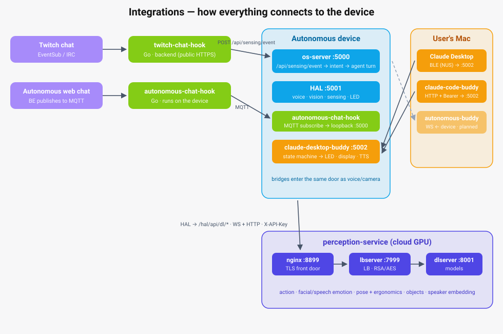

# Integrations

Everything in this folder runs **off the device** or bridges into it from outside. None of
it is required for a device to boot or operate — the on-device OS stack lives in `os/`,
`skills/`, `robots/contract/`, and `robots/`. Remove this whole folder and the device still
runs; you just lose the optional extras: desktop companions, external chat sources, and
cloud GPU perception.

## Map

| Project | What it is | Language / platform | How it talks to the device |
|---------|-----------|---------------------|----------------------------|
| [`companions/autonomous-buddy/`](companions/autonomous-buddy/) | Menu-bar / desktop app so the robot can open apps, type, click, and screenshot on your computer | Swift (macOS 13+) + Go desktop (Windows/Linux) | Device → computer over WebSocket; 6-digit pair from Home |
| [`companions/claude-desktop-buddy/`](companions/claude-desktop-buddy/) | Device-side daemon that mirrors Claude Desktop / Claude Code activity onto the device (LED, display, TTS) and relays voice approvals | Go (runs **on** the device) | Mac → device over BLE (Nordic UART) from Claude Desktop; HTTP `:5002` push from the bundled `claude-code-buddy` plugin |
| [`chat-bridges/twitch-chat-hook/`](chat-bridges/twitch-chat-hook/) | Twitch live chat → device sensing events | Go (stdlib only) | Twitch EventSub webhook (HTTPS) or anonymous IRC fallback in; `POST /api/sensing/event` out |
| [`chat-bridges/autonomous-chat-hook/`](chat-bridges/autonomous-chat-hook/) | Autonomous web chat → device sensing events | Go | MQTT subscribe in; `POST /api/sensing/event` out |
| [`perception-service/`](perception-service/) | Cloud GPU inference for models the HAL can't run locally (action, facial/speech emotion, pose + ergonomics, object detection, speaker embedding) | Python (FastAPI, CUDA, Docker) | Device HAL → service over WS + HTTP at `/hal/api/dl/*`, auth via `X-API-Key` |

## How they connect

- **Chat bridges** enter through the same door as every other sense: `POST /api/sensing/event`
  on os-server (`:5000`, LAN-gated — see `system/server/server.go`). Messages get an
  intent match first, then an agent turn, exactly like voice or camera input.
- **Perception service** is reached from the HAL via `DL_BACKEND_URL` and the `DL_*_ENDPOINT`
  paths in `hal/config.py`. If the URL is unset, remote perceptions simply stay off.

## Projects

**`companions/autonomous-buddy/`** — TeamViewer-style remote control of your computer, driven
by AI through the device. Pairing code from Home, persistent `/api/buddy/ws`, command
dispatch. Mac is the full click/screenshot path; Windows/Linux open sites and type.
See [its README](companions/autonomous-buddy/README.md).

**`companions/claude-desktop-buddy/`** — a small Go daemon on the device that receives Claude
Desktop's live activity over Bluetooth LE, derives a state (`idle` / `busy` / `attention`), and
reflects it on the device. Exposes HTTP `:5002` for status and voice tool-call approvals; the
sibling `claude-code-buddy/` Claude Code plugin pushes over that same port instead of BLE.
See [its README](companions/claude-desktop-buddy/README.md).

**`chat-bridges/`** — two self-contained Go modules that turn external chat into sensing
events: `twitch-chat-hook` (EventSub webhooks with HMAC verification, plus an anonymous IRC
fallback) and `autonomous-chat-hook` (MQTT subscriber for the Autonomous web chat).
See [the chat-bridges README](chat-bridges/README.md).

**`perception-service/`** — the GPU backend (formerly `dlbackend`): `dlserver` (`:8001`) runs
the models, an optional `lbserver` (`:7999`) round-robin proxy terminates RSA+AES encryption,
and nginx (`:8899`) is the TLS front door. See [its README](perception-service/README.md) and
the current docs under [`perception-service/docs/`](perception-service/docs/README.md).

## Conventions

- Each project is **self-contained**: its own `go.mod` (buddy daemon, both chat bridges),
  own SPM package (`autonomous-buddy/macos`) wrapped by its local `Makefile`, or own `Makefile` + Docker stack
  (`perception-service`).
- Build/release goes through the **top-level `Makefile`**: `buddy-build`, `twitch-build-irc`,
  `autonomous-build-chat` (cross-compile to linux/arm64), and the release targets
  `upload-claude-desktop-buddy`, `upload-autonomous-buddy` (macOS DMG),
  `upload-twitch-irc`, `upload-autonomous-chat`. `perception-service` builds and deploys via
  its own `Makefile` and `docker-compose.yml` instead.
- English comments, docs kept in sync with code — see the repo root `CLAUDE.md`.
